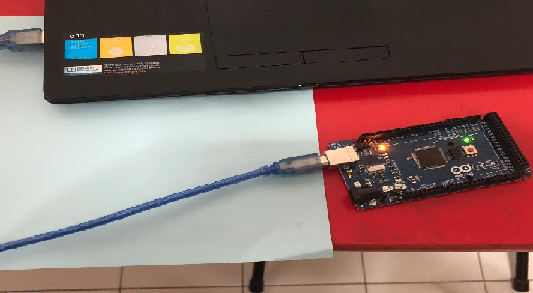
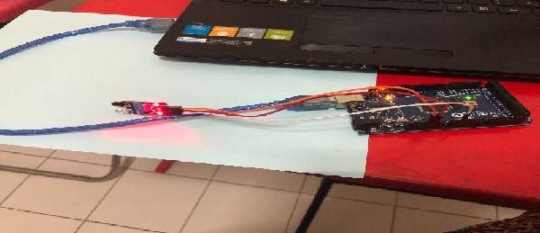
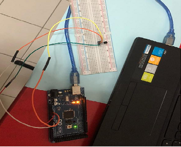
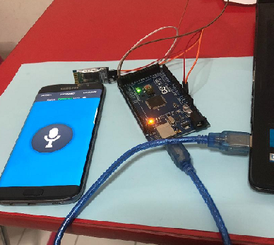
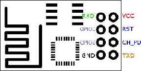
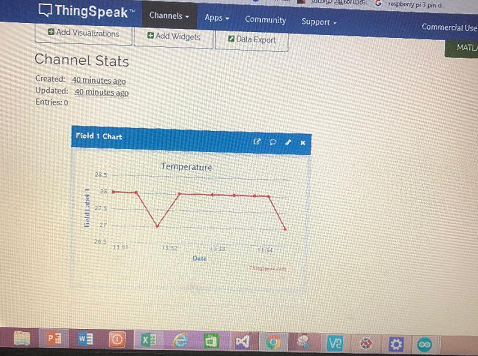
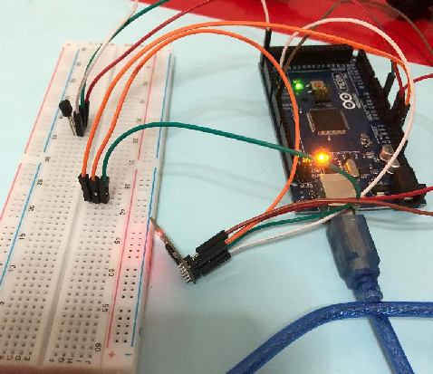

<<<<<<< HEAD
Simple IOT Projects(7)
======================

Simple IOT Projects (7)

**1. Program to Switch LED connected to PIN13 in Arduino Mega**

Requirements:

-   Arduino Mega

-   USB Cable and PC

Here, I programmed in Arduino IDE, to switch ON and OFF LED, with some delay.

**2. Program to read Proximity Sensor connected to Arduino Mega**

Requirements

-   Arduino Mega

-   Proximity Sensor

-   USB cable, Jump wires & PC

Since Arduino Mega has inbuilt ADC, it can read analog sensors too.

**3. Program to Control LED from PC**

Requirements

-   Arduino Mega

-   USB cable and PC

Here I program in such a way that, when I press ‘a’ in PC, LED - Glow, and press
‘b’ in PC, LED – OFF.

**4. Program to read temperature in Serial Monitor**

Requirements

-   Arduino Mega

-   LM35(Temp Sensor)

-   USB Cable, Jump Wires and PC

Here Room temperature can be seen, with the help of this program.

Here, the temp are shown in serial monitor.

The below figure shows the connection. LM35 should be connected to 5V.

**5. Program to control LED using Arduino Voice control app from Android phone
via Bluetooth (HC05)**

Requirements

-   Arduino Mega

-   Bluetooth Device – HC05

-   Android Mobile with Arduino Voice control App

-   USB cable and PC

Here TX and RX pins from HC05 is connected to RX and TX pins of Arduino. Connect
the phone to available HC05 blutooth, and tell “open” from the app, the LED pin
will be ON and tell “close”, the LED pin will be OFF.

**6. Creating HTTP Client and HTTP Server with ESP8266-01**

Requirements

-   ESP8266 01

-   Arduino Mega

-   PC and USB cable

ESP8266-01- do not have a USB port. To connect esp with PC, Arduino Mega acts as
a bridge.

So TX and RX pins of Arduino is connected with TX and RX pins of esp. Here it is
obtained by using AT commands.

-   Connect ESP to Router

-   Configure ESP as a Server // Enable Multiplexing into it.

-   Sending request to ESP

-   Providing response to Client.

**7. Program- Arduino to read the temperature and send the value to
Thingspeak.com IOT Cloud via ESP8266 01**

Requirements

-   Arduino Mega

-   ESP8266-01

-   LM35

-   PC, Jumper wires and USB Cable

Here, I programmed Arduino to configure ESP8266 by AT commands and then send the
temp data. So here TX and RX pins of Arduino are connected with RX and TX pins
of ESP.

ESP8266 -01 PIN DIAGRAM

Here ESP8266-01, operates in 3.3V, to connect it to wifi – Connect CH_PD to 3.3V

=======
# Simple IOT Projects(7)
                   
>>>>>>> 309a21c22f10596bd58a1135821c7854200cadc3
